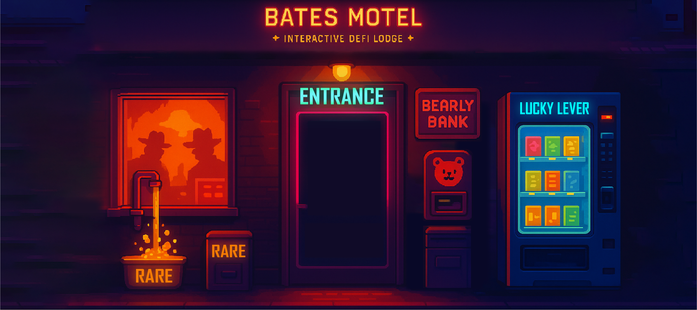

# 🏨 Bates Motel - The MultiversX High-Yield Staking Ecosystem



Welcome to the **Bates Motel**, a premium, high-stakes Decentralized Finance (DeFi) ecosystem built exclusively for the **MultiversX** blockchain. Combining a dark, cinematic aesthetic with aggressive yield-generation mechanics, Bates Motel offers users a unique environment to stake, earn, and play.

## 🗝️ About the Motel

Bates Motel is not just another staking platform; it’s an experience. Structured like a high-end noir establishment, the dApp guides users through various "Rooms," each offering different financial opportunities—from single-asset staking to high-reward liquidity provision.

### 🌓 The Vibe
Inspired by the classic noir and horror aesthetic, we’ve created a "Vibe" that feels premium, secretive, and high-stakes. With deep purple accents, glassmorphic interfaces, and pixel-precise animations, the Motel is designed to be the ultimate digital lounge for MultiversX "Degens."

---

## 🚪 Room Directory

The Motel is divided into several specialized rooms, each serving a unique purpose in the ecosystem:

### 🎭 The Entrance (Lobby)
Your gateway to the Motel. This is where you decide your path. From here, you can access the Faucet for test tokens, enter the main Motel hub, or visit our partners like FudOut.

### 🏢 The Builders Room
Designed for the architects of the ecosystem. This room features specialized farms (IDs 128-135) that offer aggressive rewards for those willing to commit liquidity. It's the engine room of the Motel.

### 🍆 The Jorkin Room (Exclusive)
Where finance meets fun. This room features the **Speed Jorkin** clicker game—a high-energy mini-game where users can test their clicking speed while monitoring their high-yield stakes (Farm 127).

### 💎 Staking Rooms
For those who prefer a simpler path. Single-token staking pools (Farms 117-121) allow you to grow your holdings without the complexity of LP management.

### 🌊 LP Staking Rooms
The foundational liquidity hub. Stake your LP tokens (Farms 122-126) to earn a variety of reward tokens, including RARE, BATES, and DBATES.

### 🛗 The Elevator (Central Navigation)
Our custom-built navigation hub. Move seamlessly between floors and rooms with a cinematic UI that keeps the Motel experience immersive.

---

## 🪙 Tokenomics & Mechanics

### 💳 The RARE Utility
**RARE** is the lifeblood of the Bates Motel. To maintain the exclusivity and sustainability of our high-yield rooms, a flat fee of **10 RARE** tokens is required for:
*   **Staking** new liquidity.
*   **Unstaking** your holdings.
*   **Harvesting** your hard-earned rewards.

This mechanism ensures a constant burn/re-circulation of RARE, adding value to every holder in the ecosystem.

### 🏆 Multi-Reward Ecosystem
Unlike standard farms, several rooms in the Bates Motel distribute **multiple tokens** as rewards. You might stake one LP pair and wake up with a basket of BATES, RARE, and other partner tokens.

### 📊 Real-Time Analytics
Our `SmartContractService` integrates directly with MultiversX and JExchange APIs to provide real-time:
*   **Live APR Calculation**: Dynamic yields based on current TVL and reward emissions.
*   **Token Pricing**: Real-time USD values for all assets.
*   **Network Stats**: Current epoch monitoring for accurate emission timing.

---

## 🛠️ Technology Stack

Bates Motel is built using state-of-the-art web and blockchain technology:

*   **Framework**: [Next.js 13+](https://nextjs.org/) (App Router)
*   **Blockchain SDK**: [@multiversx/sdk-dapp](https://docs.multiversx.com/sdk-and-tools/sdk-dapp/)
*   **Styling**: [Tailwind CSS](https://tailwindcss.com/)
*   **Animations**: [Framer Motion](https://www.framer.com/motion/) & [GSAP](https://gsap.com/)
*   **UI Components**: [Radix UI](https://www.radix-ui.com/) & [Lucide React](https://lucide.dev/)
*   **State Management**: React Hooks & Custom Providers
*   **Monitoring**: [Sentry](https://sentry.io/) & [Google Analytics](https://analytics.google.com/)

---

## 🚀 Getting Started

### Prerequisites
*   Node.js 18+
*   Yarn or NPM
*   A MultiversX Wallet (DeFi Wallet, xPortal, or Ledger)

### Installation

1.  Clone the repository:
    ```bash
    git clone https://github.com/kolepidas/batesmotel.git
    ```
2.  Install dependencies:
    ```bash
    yarn install
    ```

### Running Locally

Run the development server on your preferred network:

**Mainnet:**
```bash
yarn start:mainnet
```

**Testnet:**
```bash
yarn start:testnet
```

**Devnet:**
```bash
yarn start:devnet
```

Open [http://localhost:3000](http://localhost:3000) to check-in to your room.

---

## 📡 Smart Contract Integration

The Motel interacts with the following core contracts on the MultiversX Mainnet:

*   **Farms Contract**: `erd1qqqqqqqqqqqqqpgql6dxenaameqn2uyyru3nmmpf7e95zmlxu7zskzpdcw`
*   **RARE Fee Collector**: `erd18d8nv0h90pwjxt3c4af8kktfpr2ksyyjvc82t0gk5n8dtaf252esa7jfcm`

---

## 📜 Disclaimer

Trading and staking digital assets involve significant risk. The "high-yield" nature of the Motel rooms comes with corresponding volatility. Only stake what you can afford to lose. This project is for community engagement and DeFi exploration.

---

<div align="center">
  <p><i>The Motel is always open. Stay as long as you like.</i></p>
  <p><b>Built with ❤️ for the MultiversX Community</b></p>
</div>
